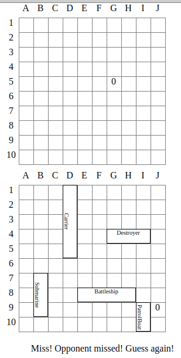

# battleship
An assignment from [The Odin Project](https://www.theodinproject.com/) to create the game of Battleship using javascript.

Additional information can be found at https://www.theodinproject.com/lessons/javascript-battleship

# How to Play
**1. Place Ships**

Drag and drop your ships onto the playfield, using left click to rotate the ships.\
When all five ships are positioned click the <code>Start Game</code> button to begin.

**2. Attack**

You, and the computer take turns clicking on cells to make guesses. An **O** indicates a miss and an **X** indicates a hit. When all ships of one player are fully sunk the game ends.

# Features

- a user interface using HTML and CSS
- ship placement
- a simple AI opponent

## Technologies
- Javascript
- Webpack
- Jest
- HTML
- CSS
- Git